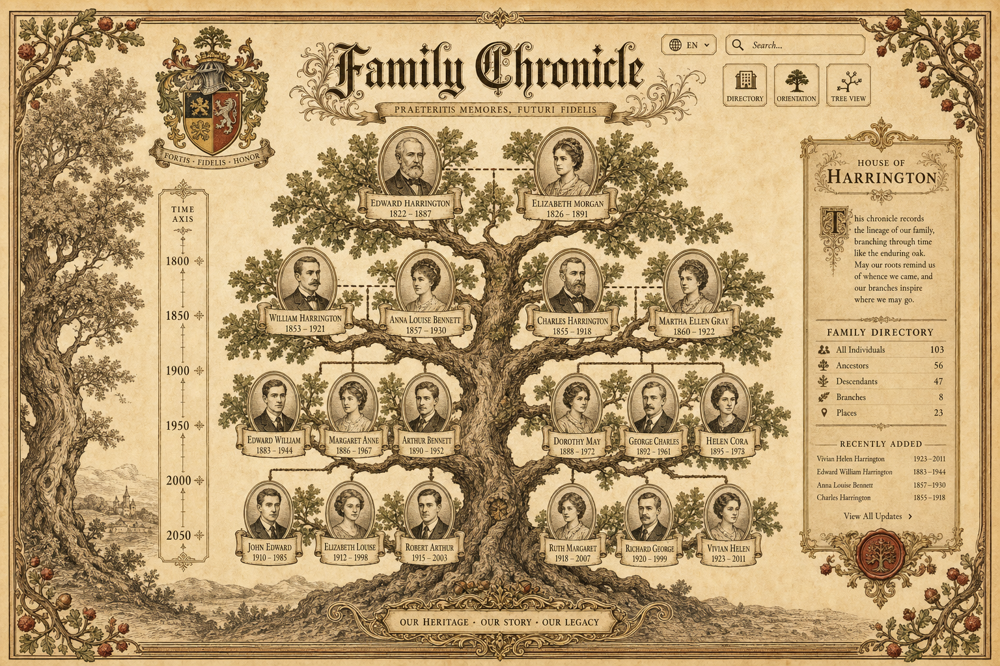
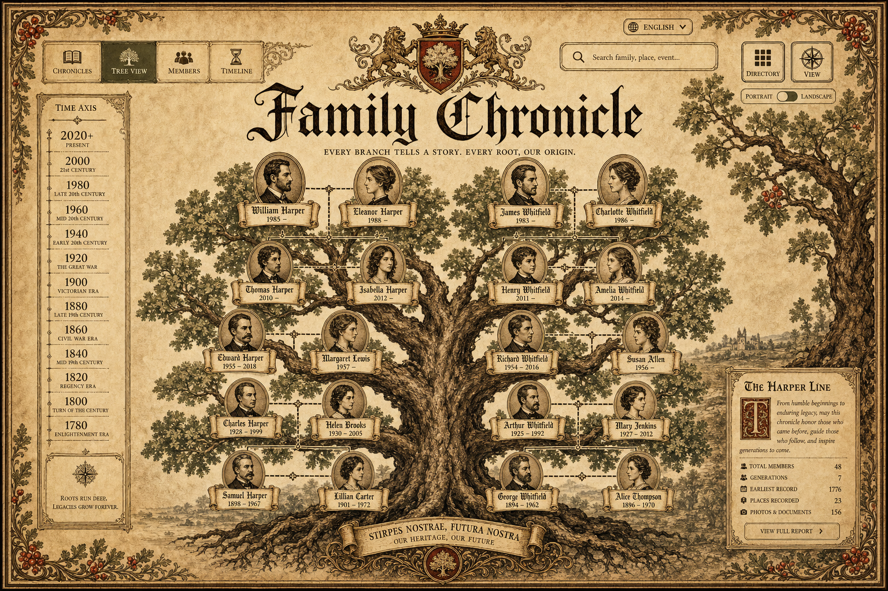
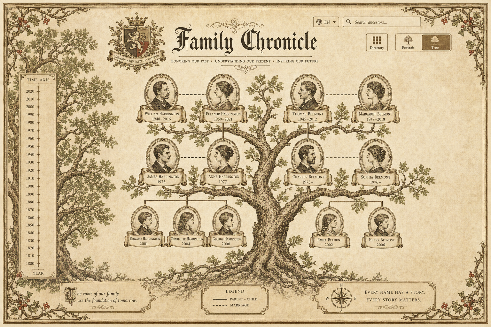
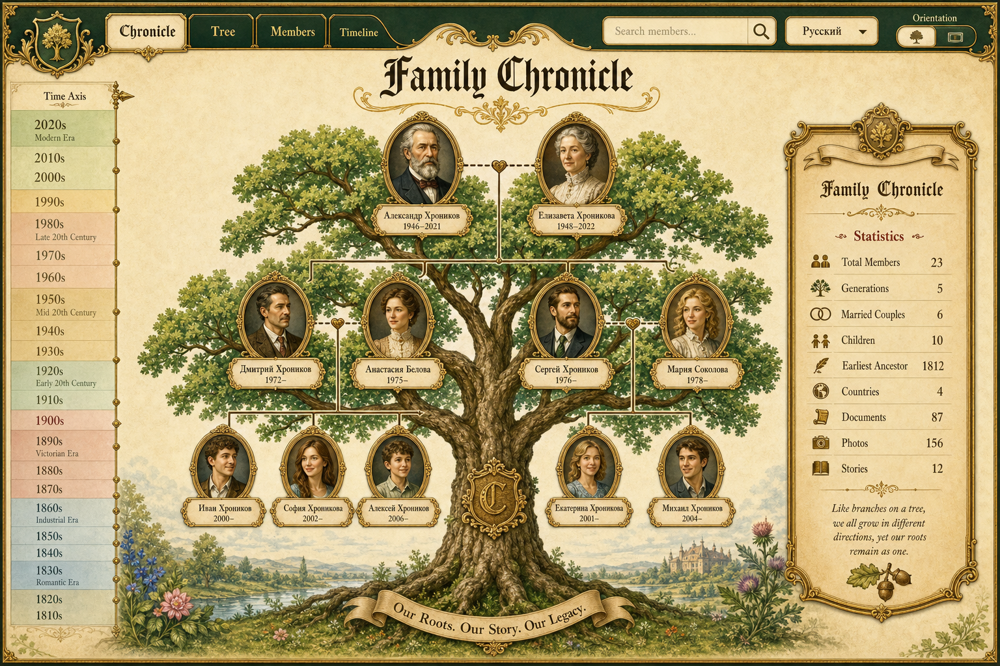
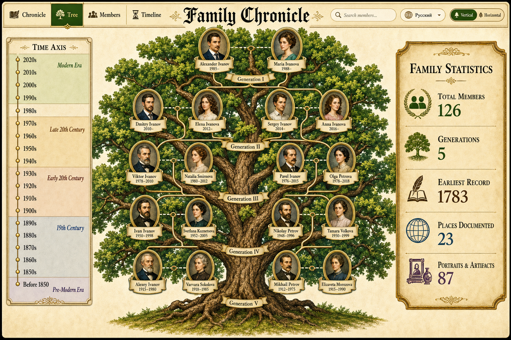
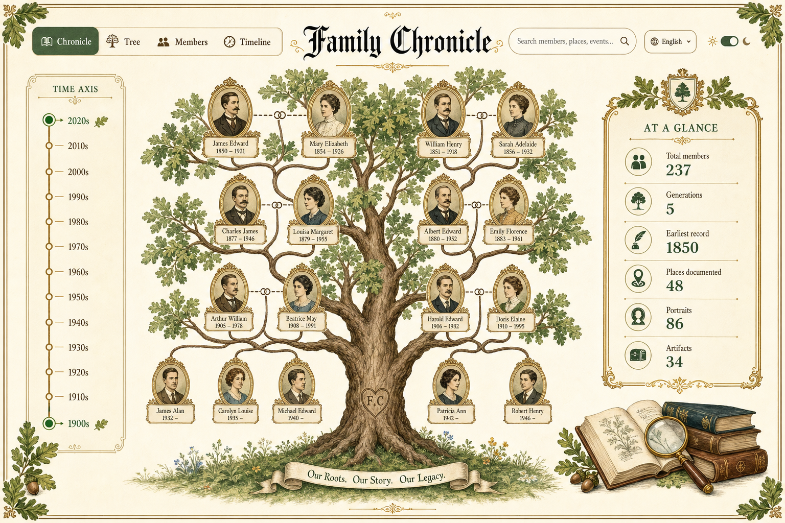

# Design history — Family Chronicle

This folder preserves the visual exploration behind the **Family Chronicle** redesign:
the AI-generated concept comps, the interactive HTML prototypes, and the earlier
brainstorm boards.

These are **archived artifacts** — none are built or served by the app. They're kept
here so the design journey lives alongside the code. The shipped UI is the Vue app in
[`src/frontend`](../../src/frontend); its direct ancestor is
[`prototypes/tree-prototype-v1.html`](prototypes/tree-prototype-v1.html).

> Generated with **gstack** (`design-consultation` / `design-shotgun`, via OpenAI
> `gpt-image-2`) and the **superpowers** brainstorming companion.

## The journey, in three phases

1. **Exploration** (`exploration/`) — early brainstorm boards: how to render the oak,
   how to group people, scroll-cartouche cards, era handling, portrait frames.
2. **Concept comps** (`gstack-comps/`) — six full-page AI renders across two rounds,
   used to choose an art direction.
3. **Interactive prototypes** (`prototypes/`) — real, pannable/zoomable HTML;
   `tree-prototype-v1.html` is the one that became the app.

---

## 1 · gstack concept comps

Static AI concept art — striking, but not real UI. Round 1 explored three "gothic"
directions; round 2 refined the winner (more colour, B's tab + orientation controls,
a stats panel, Cyrillic names).

### Round 1 — three directions

| A · Illuminated parchment | B · Blackletter sepia | C · Heraldic engraving |
| :---: | :---: | :---: |
|  |  |  |

> Owner's verdict: *"C better, B absolutely not."*

### Round 2 — refined

| A · Storybook oak | B · Engraved + stats | C · Light "at a glance" |
| :---: | :---: | :---: |
|  |  |  |

Round-2 **B** is the conceptual ancestor of the shipped UI — the "Family Statistics"
panel, the Vertical/Horizontal toggle, and the time axis with era bands.

---

## 2 · Interactive prototypes (`prototypes/`)

Open directly in a browser — self-contained (fonts load from the Google Fonts CDN).

| File | What it is |
| --- | --- |
| [`tree-prototype-v1.html`](prototypes/tree-prototype-v1.html) | **The one that shipped.** Interactive oak, pan/zoom, orientation toggle, colourful monogram medallions, zoom-adaptive time rail. |
| [`tree-prototype-v2.html`](prototypes/tree-prototype-v2.html) | The "B skin" alternative — more colour, ornate green+gilt frame, cameo medallions. |
| [`visual-direction.html`](prototypes/visual-direction.html) | The three gothic directions (A Illuminated · B Cathedral Night · C Heraldic Engraving). |
| [`visual-frame.html`](prototypes/visual-frame.html) | Page-frame options: berry-branch corners · painted-oak margin · iron-vine borders. |
| [`visual-bg-e451d9.html`](prototypes/visual-bg-e451d9.html) | Background-image experiment using `bg-e451d9.jpg`. |
| [`bg-e451d9.jpg`](prototypes/bg-e451d9.jpg) | The art-nouveau parchment reference (upscaled), used by the background experiment. |

## 3 · Earlier exploration boards (`exploration/`)

From the first redesign brainstorm — open in a browser:

[`render-approach`](exploration/render-approach.html) ·
[`motifs-and-scope`](exploration/motifs-and-scope.html) ·
[`grouping-options`](exploration/grouping-options.html) ·
[`scroll-cartouche`](exploration/scroll-cartouche.html) ·
[`portrait-frames`](exploration/portrait-frames.html) ·
[`era-focus`](exploration/era-focus.html) ·
[`era-split`](exploration/era-split.html)
